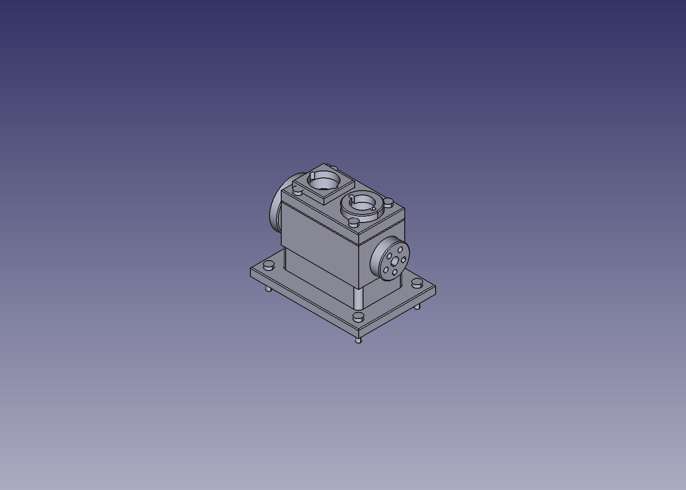
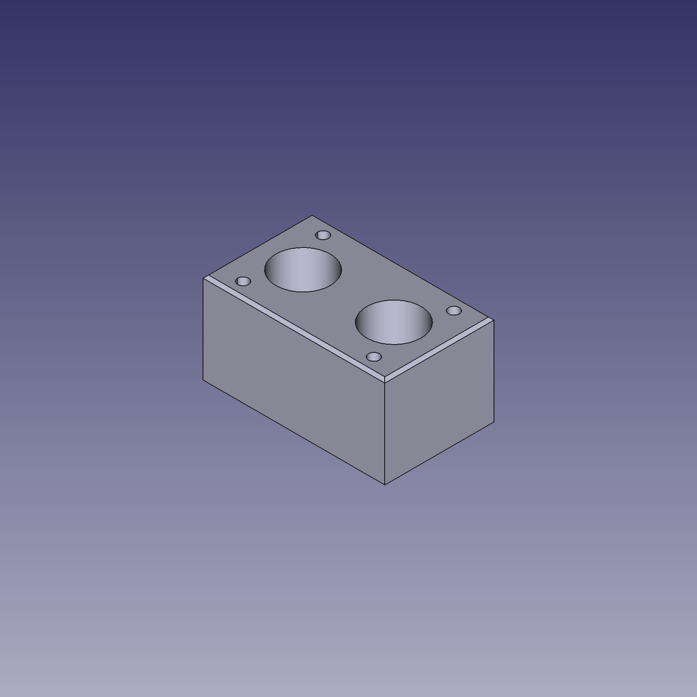
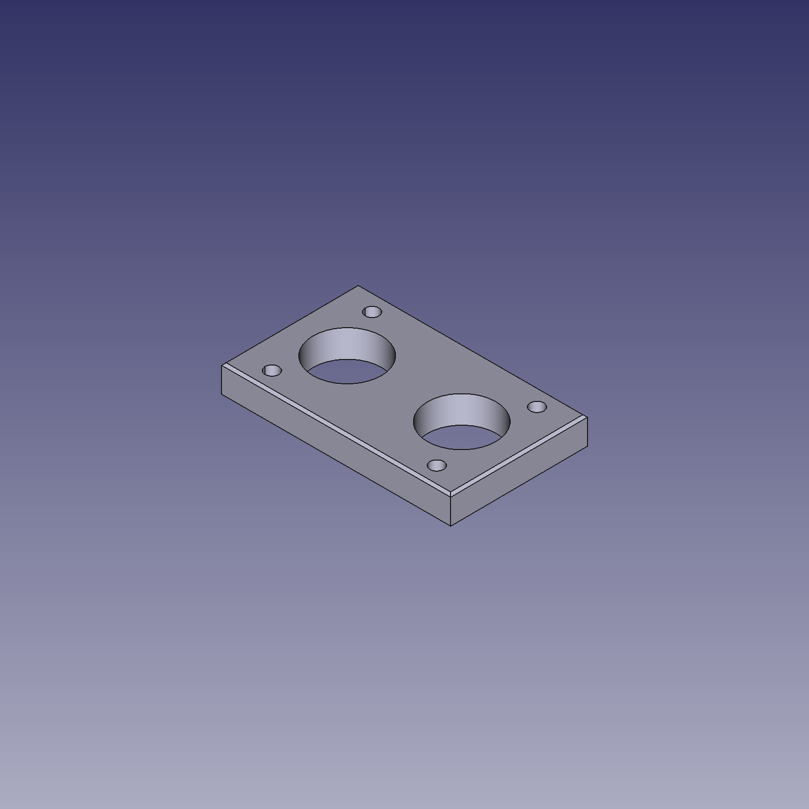
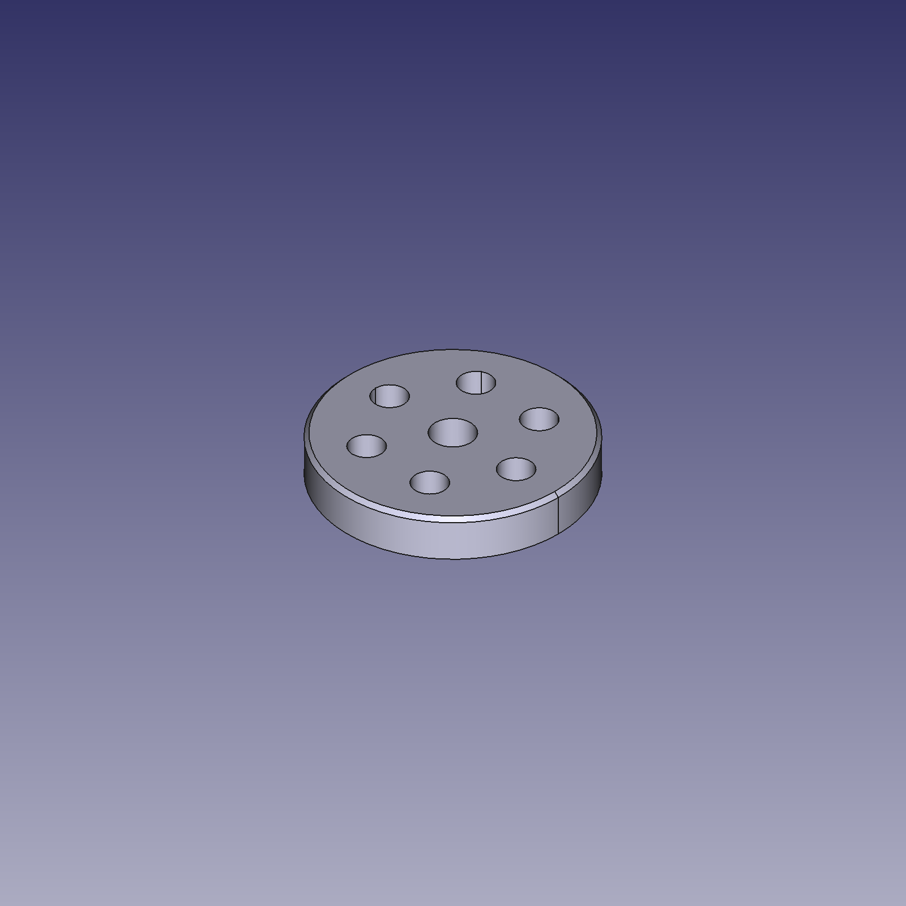
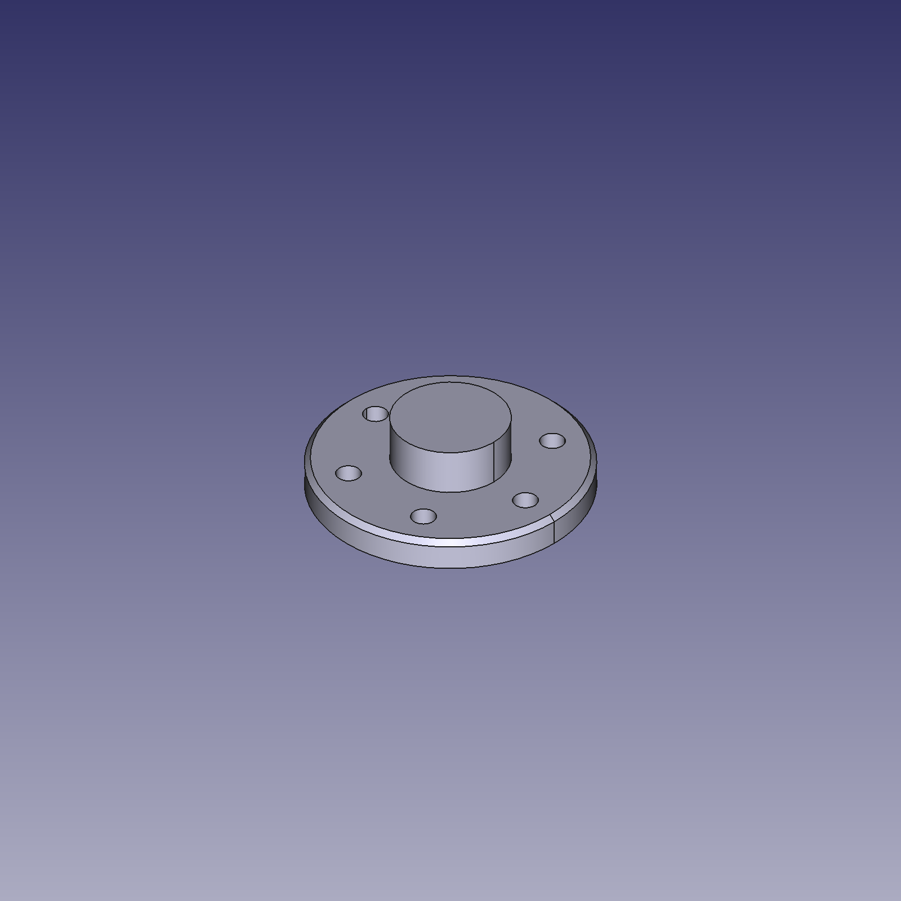

# Twin Engine, Built on a Phone 🤖🔧

A 1.2M-parameter CAD agent (**[Taiga-S1](https://github.com/shhivv/taiga-s1)**) driving **FreeCAD 1.0 — entirely on an Android phone** (Termux + Debian proot + Termux:X11). It modeled a twin-cylinder engine mockup part by part, live in the FreeCAD GUI: 19 parts, every one at volumetric IoU 1.0.

**Watch it run** (72 frames, one crank revolution — pistons on opposed strokes, flywheel + pulley spinning):

https://github.com/BenJooYT/taiga-s1-android/releases/download/v1/engine_run.mp4

## The engine

| Part | Built | Result |
|---|---|---|
| Crankcase (twin + inline-4) | 44/44 · 58/58 steps | IoU 1.0 |
| Head plate, oil pan, 2× piston, flywheel | 44/44 · 14/14 · 11/11 · 27/27 | IoU 1.0 |
| Bed plate, pulley, intake + exhaust flanges, bolts | 48/48 · 27/27 · 28/28 · 27/27 · 16/16 | IoU 1.0 |
| Full assembly (18 parts mated) | scripted placements | `files/twin_engine_full.FCStd` |

 
 

Interactive viewer with exploded assembly: open `site/index.html` (or serve the `site/` folder) — Three.js, orbit + explode slider, works offline.

## Reproduce it on Termux/Android

1. **Termux** (F-Droid build) + Termux:API mindset: `pkg install proot-distro` → `proot-distro install debian`.
2. **Inside Debian:** `apt-get install -y freecad python3 python3-venv x11-apps`, then a venv with `torch numpy safetensors huggingface_hub pytest` (`pip install torch` works — glibc aarch64 wheels).
3. **Clone Taiga-S1** to `/root/taiga-s1`, `pip install -e '.[dev]'`. Workers must use **system python**, not FreeCAD's wrapper (it eats stdin / needs a display):
   `FREECAD_PYTHON=/usr/bin/python3 FREECAD_LIB=/usr/lib/freecad-python3/lib` + FreeCAD Mod dirs on `PYTHONPATH` — see `android/run.sh`.
4. **GUI:** `pkg install x11-repo termux-x11-nightly`, install the Termux:X11 APK, `termux-x11 :0`, launch FreeCAD with the socket-server macro (`android/` has the launcher), drive it with `scripts/gui_demo.py --goals my_goals.json --name my_part`.
5. **Caveats found the hard way:** Ubuntu proot has no FreeCAD/arm64 (use Debian); headless-saved files load with ViewObjects invisible (flip them in-GUI); `proot --kill-on-exit` eats background daemons (use a persistent holder session).

## Files

- `site/` — interactive mockup website (viewer, exploded assembly, video, gallery, FCStd downloads)
- `android/` — `run.sh` (tests/demo/GUI commands) + goal JSONs (`my_goals.json`, `engine*.json`)
- `assets/` — progress + final photos
- Upstream model + runtime: [shhivv/taiga-s1](https://github.com/shhivv/taiga-s1) (MIT)
